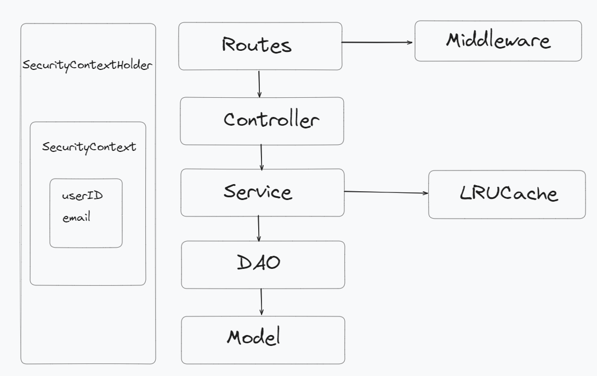
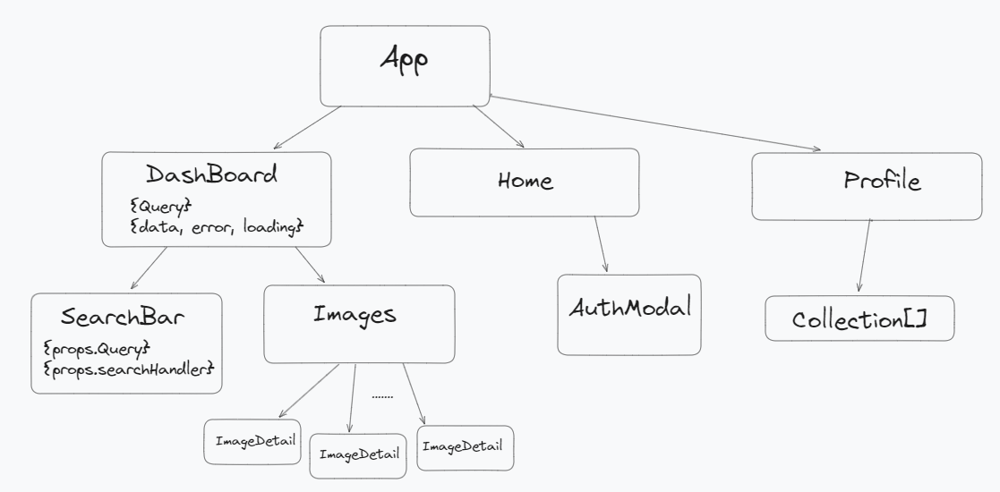

# Snowpack interview coding project
### Stack  
Nodejs, Typescript, Express, React, MongoDB  
### Feature  
- Search image
- Add image into collection  
### General  
- Implement a CI CD pipeline to automatically deploy for each commit on master 
- Group folder by layer (due to the small size of project)
- Dynamically switch from development to production using env
### Backend Architecture  

- Centralize configuration
- Centralize error handling
- JWT authentication
- Implement LRU Cache, improve x10 search image time
### Frontend Components  

