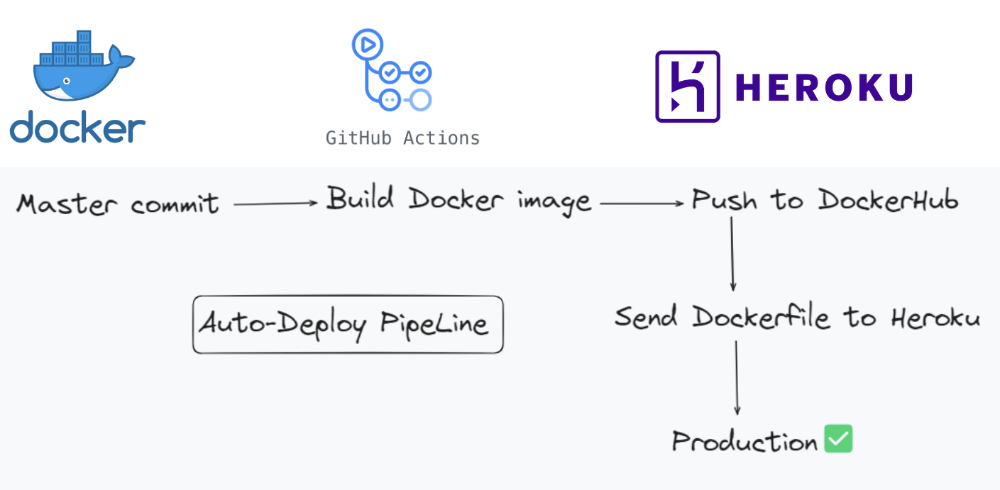
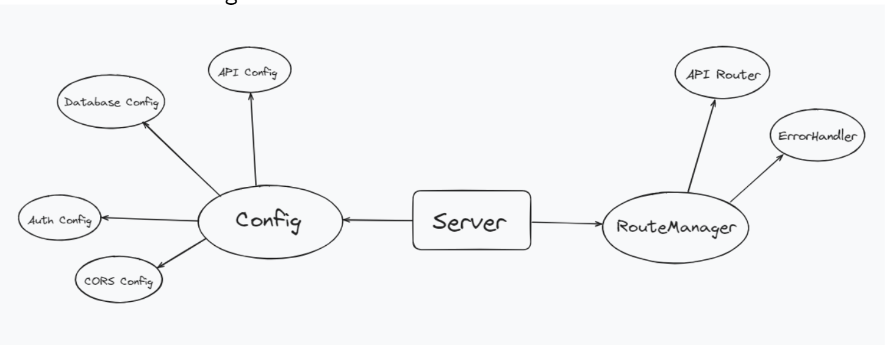
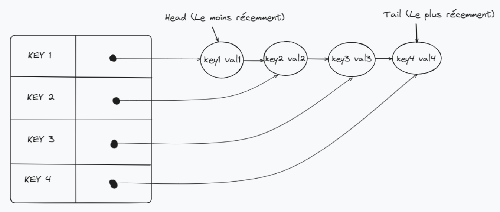
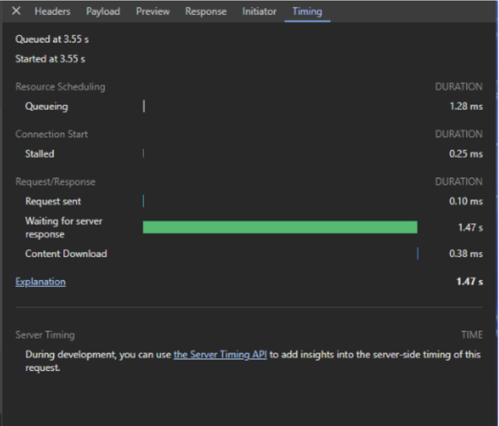
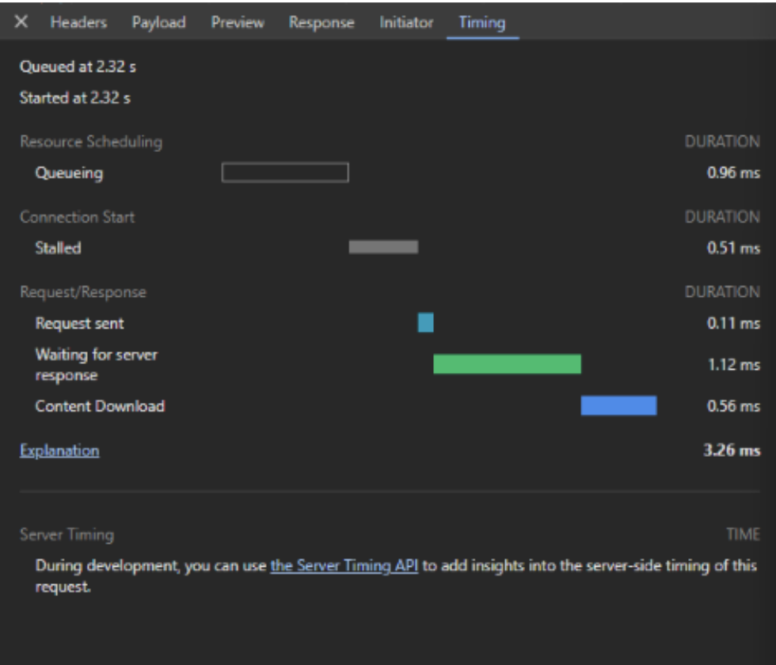

# Snowpack interview coding project
### Stack  
Nodejs, Typescript, Express, React, MongoDB  
### Feature  
- Search image
- Add image into collection  
### General  
- Implement a CI CD pipeline to automatically deploy for each commit on master 

- Group folder by layer (due to the small size of project)
- Dynamically switch from development to production using env
### Backend Architecture  

- Centralize configuration et error handling

- JWT authentication
- Implement LRU Cache, improve x1000 search image time

- Image search without cache takes: 1470 mile-seconds

- Image search without cache takes: 1.12 mile-seconds

### Frontend Components  

